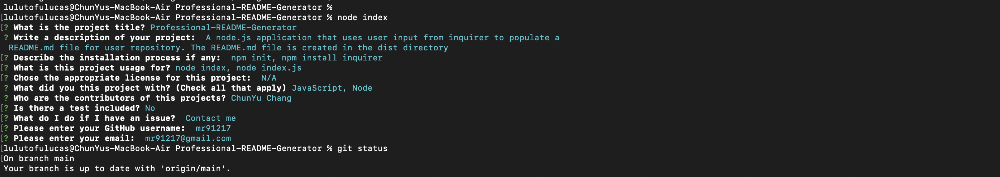

<h1 align="center">Professional-README-Generator </h1>
 
<br />
## User Story
  
```
AS A developer
I WANT a README generator
SO THAT can quickly create a professional README for a new project 
```

## Description
  A node.js application that uses user input from inquirer to populate a README.md file for user repository. The README.md file is created in the dist directory 
## Screenshot

## Table of Contents
- [Description](#description)
- [Installation](#installation)
- [Usage](#usage)
- [License](#license)
- [Languages](#languages)
- [Contributing](#contributing)
- [Tests](#tests)
- [Questions](#questions)
## Installation
  `npm init`
  
  `npm install inquirer`
## Usage
  Run the following command at th root of your project and answer the prompted questions:<br />

  `node index.js`

  `node index`
## Languages
  JavaScript,Node
## License

<br />
This application is covered by the N/A license. 
## Contributing
  ChunYu Chang
## Questions
 Contact me<br />
<br />
## Contact
GitHub: [mr91217](https://github.com/mr91217)<br />
<br />
Email: mr91217@gmail.com<br />
<br />
This README was generated with ❤️ by [Professional-README-Generator]
https://github.com/mr91217/Professional-README-Generator
   